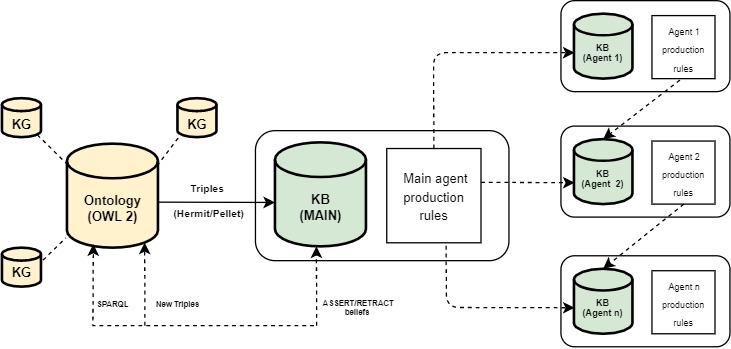
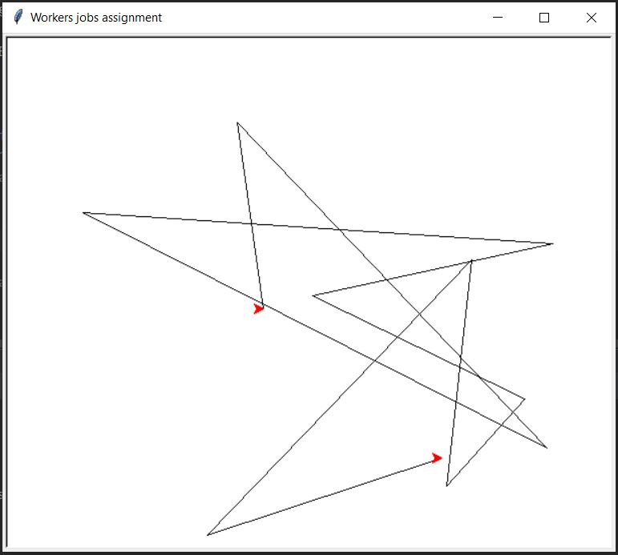

# SEMAS

This is the repository of the Python (3.7+) implementation of SEMAS (**SE**mantic **M**ulti-**A**gent **S**ystem), which integrates 
Multi-Agent systems with the Semantic Web. SEMAS is built on top of the framework [PHIDIAS](https://ceur-ws.org/Vol-2502/paper5.pdf).


# Installation

---------------

This repository has been tested on Python 3.10 64bit (Windows 10/PopOs linux), with the following packages versions:

* [PHIDIAS](https://github.com/corradosantoro/phidias) (release 1.3.4.alpha) 
* [Owlready2](https://pypi.org/project/Owlready2/) (ver. 0.26)


### PHIDIAS

---------------

```sh
> git clone https://github.com/corradosantoro/phidias
> cd phidias
> pip install -r requirements.txt
> pip install .
```


### Owlready2 

---------------

from prompt:
```sh
> pip install owlready2
```

### rdflib 

---------------

from prompt:
```sh
> pip install rdflib
```


### Starting agent

---------------

First of all, you must create the ontology. In order to do that, you must follow three preliminar steps:

* Choose the owl file name, by setting the variable FILE_NAME (ONTOLOGY Section) in the config.ini (test.owl for instance)
* Execute semas.py

```sh
Creating new test.owl file...

Please Re-Run Semas.

Process finished with exit code 0
```

* Re-execute Semas

```sh
Loading existing test.owl file...

NLP engine initializing. Please wait...

	PHIDIAS Release 1.3.4.alpha (deepcopy-->clone,micropython,py3)
	Autonomous and Robotic Systems Laboratory
	Department of Mathematics and Informatics
	University of Catania, Italy (santoro@dmi.unict.it)
	
eShell: main > 
```

Now Semas is ready.
Unless you delete the owl file or choose to create another ontology, the agent will try to load every time the specified file in confi.ini.


## SEMAS agent's **mental attitudes**

---------------
The *mental attitudes* (Beliefs, Desire and Intentions) represent respectively the **information**, **motivational** and **deliberative**
states of the agent. SEMAS aims to integrate distinct models' mental attitudes, in order to leverage all their features, by considering the following schema for Agents:


| BDI-Model  | Semantic Web                     | PHIDIAS   |
|------------|----------------------------------|-----------|
| Belief     | (Agent, hasBelief, Belief)       | Belief    |
| Desire     | (Agent, hasDesire, Desire)       | Procedure |
| Intention  | (Agent, hasIntention, Intention) | Reactor   |

PHIDIAS mental attitudes are built starting from [this](https://cdn.aaai.org/ICMAS/1995/ICMAS95-042.pdf) paper, by considering the following assumptions:

1. We esplicitly represent only beliefs about *current* state of the world.
2. We represent the information about means of achieving certain future world states and the options available to the agent as *plans*, which can be viewed as a special form of beliefs.
Each plan has a *body* describing the primitive actions os subgoal that have to be achieved for plan execution to be successful. The conditions under which a plan can be chosen as an option
are specified by an *invocation condition* and (possibly) one (or more) *pre-conditions*. The invocation condition specifies the "triggering" event that is necessary for invocation of the plan,
and the pre-conditions specifies the situation that must hold for the plan to be executable.
3. Each intention that the system forms by adopting certain plans is represented implicitly using a conventional run-time stack of hierarchically related plans (similar to how Prolog interpreter
handles clauses). Multiple intentions stacks can coexist, either running in parallel, suspended until some conditions occurs, or ordered for execution in some way.

Each plan is invoked within a production rule which follows the sintax:

<p align="center"><b>[TRIGGERING EVENT] / [CONDITIONS] >> [PLAN]</b></p>


* **[TRIGGERING EVENT]**: the triggering event can be a **Belief**, a **Reactor** (a special belief which interact with production rules but without residing in the Knowledge base), or a **Procedure**
which is a way for manually trigger a corresponding rule.
* **[CONDITIONS]** (optional): one or more **Belief**, or **Active Belief** (a special belief which returns *True*/*False* on the basis of Python code execution)
* **[PLAN]**: a plan can be made of beliefs assertion/retraction or execution of high level language code invoked by instances of the PHIDIAS class **Action**. 

For more information about PHIDIAS the reader is referred [here](https://www.dmi.unict.it/santoro/teaching/sr-2024/slides/PHIDIAS.pdf).


### OWL Beliefs, Desires, Intentions

---------------

All OWL Semantic mental attitudes are represented by classes, subclasses, individuals and their properties, under the shape of triples. All involved entities must be specified in config.ini
(which by default they describe a toy domain as case-study), in Section [CLASSES] with the variable *Entities*. All individuals are defined under the Section [INDIVIDUALS] with corresponding
items names. Beliefs, Desires and Intentions are represented with individuals properties defined in [CLASSES] and grounded as triples with variables having same name in Section [INDIVIDUALS].

### PHIDIAS correspondence for Beliefs, Desires, Intentions

---------------

As highlighted above in PHIDIAS (thus also in SEMAS) some of typical BDI features are implicitly defined. In order to create a bridge between the two models, by considering the above schema, we employ the following
heuristic:

1. **Beliefs**: Each belief can be asserted in the KB as follows (in this case the belief *SALUTATION* contains the string *Hello*), by PHIDIAS shell of inside a production rule:
```sh
> +SALUTATION("Hello")
```
Similarly, the belief can be retracted from the KB:
```sh
> -SALUTATION("Hello")
```

Since in Python code there cannot exist classes with same names but distinct usage, we are forced to choose distinct name for OWL beliefs (which are individuals properties) and PHIDIAS beliefs.
When triples are imported from OWL, they are asserted with the shape: "TRIPLE(object, property, subject)" (for instance: *TRIPLE(Fabio, coAuthorWith, Misael)*). Afterward, a production rule system
invoked by a procedure (load) will retract such beliefs and assert new ones as defined in the correspondence entries in config.ini (namely, *CoAuthorship(Fabio, Misael)*).

2. **Desires**: by convention we have chosen to represent Desires with **Procedures**, which can be used to trigger manually part of the production rules stack, taking in account (or not)
of one or more arguments.

3. **Intentions**: since PHIDIAS Intentions are implicitly represented by one or more production rules, by convention we have chosen to represent them with the PHIDIAS **Reactor**
which does not pass through the KB but it can (as like as beliefs) interact with the production rules, thus possibly execute their plan.

4. **Data linking**: all OWL-PHIDIAS mental attitudes must be linked to each other, in order to interoperate, as defined in Section [CLASSES] of config.ini (under the comments "OWL-PHIDIAS beliefs/desire/intentions linking").


### OWL Reasoning

---------------

Semas integrates the explicit declaration of SWRL rules (in Section [SWRL]), whom will interact with the ontology when the variable **ACTIVE** (in Section [REASONING]) is set to *true*.
The variable **REASONER** indicates which of the integrated reasoners (HERMIT/PELLET) must be employed before every SPARQL query in some Action's PLAN. However, due to restriction given by
*Horn-like* clauses shape of SWRL rules, each rule's head can have at most one predicate. Such restriction in most cases can be overridden with the employment of PHIDIAS production rules and plans.


### Case-study: Co-Authorship and Academic Mobility

---------------
This case-study provides a formalization about interactions between Scholars in the field of Academic Mobility, in order to choose, on the basis of Co-Authorship
interaction in specific fields, the best University affiliation.


#### Ontology initialization (local)

---------------
The details of the above formalization are all defined in config.ini. Both OWL 2 ontology and PHIDIAS classes can be initialised with the command *init()* as follows:

```sh
eShell: main > init()

Initialiting Ontology...

Adding the following 1 rules to ontology: 
Rule 1: Scholar(?x), coAuthorWith(?x,?y), Scholar(?y) -> coAuthorWith(?y,?x)
Ontology saved.
```
After the *init()* procedure execution, the ontology (whose file name is defined in **FILE_NAME**, Section [ONTOLOGY] in config.ini) will be as follows:


All OWL beliefs/desires/intentions are defined by properties of individuals which are instances of subclasses of **ENTITY**. In regard of classes **BELIEF**,
**DESIRE** and **INTENTIONS**, their subclasses express the linkage with the corresponding Beliefs/Procedures/Reactors in the PHIDIAS environment.


#### Data sources (local/remote)

---------------

Triples can be imported from either local or remote source. In case of local ontology, REMOTE_SOURCE variable in config.ini (group [ONTOLOGY]) must be set with "true", 
otherwise with "false". Only in case of local resource (REMOTE_SOURCE = false), ontology must be initialized (whether the .owl file not existing) and loaded with load().

#### Ontology import (local)

---------------

First, the PHIDIAS Knowledge Base (KB) can be inspected any time with the following command:
```sh
> kb
```

The procedure *load()* must be used to import the above ontology into the PHIDIAS environment as follows:

```sh
eShell: main > load_local()

Asserting all OWL 2 beliefs triples...
Asserting triples ended.
```

Such procedure triggers a production rule whose PLAN invokes an Action (assert_beliefs_triples) to query
by means SPARQL the ontology and assert all beliefs triples. Such query might include further conditions to
constrainct the results. The query execution can also be preceded by OWL reasoning (with HERMIT/PELLET).
After the ontology import, the KB's content will be as follows:


```sh
eShell: main > kb
CoAuthorship('Fabio', 'Misael')         CoAuthorship('Misael', 'Rocco')         
Affiliation('Misael', 'University-of-Catania')Affiliation('Rocco', 'Alma-Mater-Bologna')
TopAuthorship('Fabio', 'Artificial-Intelligence')TopAuthorship('Misael', 'Artificial-Intelligence')
TopAuthorship('Rocco', 'Applied-Ontology')Selectionship('Fabio', 'University-of-Catania')
```

In case of active inference with PELLET/HERMIT before the SPARQL query, the outcome after *load()* 
will be as follows, by the virtue of the defined SWRL rule which specifies the simmetric mutual Coauthorship.

```sh
eShell: main > kb
CoAuthorship('Misael', 'Fabio')         CoAuthorship('Fabio', 'Misael')         
CoAuthorship('Rocco', 'Misael')         CoAuthorship('Misael', 'Rocco')         
Affiliation('Misael', 'University-of-Catania')Affiliation('Rocco', 'Alma-Mater-Bologna')
TopAuthorship('Fabio', 'Artificial-Intelligence')TopAuthorship('Misael', 'Artificial-Intelligence')
TopAuthorship('Rocco', 'Applied-Ontology')Selectionship('Fabio', 'University-of-Catania')
```

#### Triple store GraphDB installation (Remote) - Docker

---------------
On terminal (Semas venv):

```sh
pip install SPARQLWrapper
```

On the same path containing docker-compose.yml:

```sh
docker compose up -d
```

After container installation, follow the link http://localhost:7200/ and import rdf files to create triple stores.  
The file config.ini must contain (section [ONTOLOGY]) the triple store address in the idem TRIPLE_STORE.


#### SEMAS inference (local)

---------------
To achieve inference, one of the defined DESIRES must be employed as PHIDIAS Procedure, which are: *Publicationship()*
and *BeTopAuthorship()*. Both of them can be used with one or more arguments. For instance, supposing one want
to publish in the field of *Applied Ontology* a minimal usage is: *Publicationship("Applied-Ontology")*, whom will match (or not) with
the following defined rule in [front_end.py](front_end.py): <br>

```sh
Publicationship(X) / (CoAuthorship(Z, Y) & TopAuthorship(Y, X) & Affiliation(Z, U)) >> [show_line("Indirect match found at ",U,".\n"), -CoAuthorship(Z, Y), +ProposeCoauthorship(Z, X), Publicationship(X)]
Publicationship(X) / (TopAuthorship(Y, X) & Affiliation(Y, U)) >> [show_line("Direct match found at ",U,".\n"), -TopAuthorship(Y, X), +ProposeCoauthorship(Y, X), Publicationship(X)]

+ProposeCoauthorship(X, Y) >> [show_line("Propose co-authorship with ",X," to publish in the field of ",Y,".\n")]
```


#### SEMAS inference (remote)

---------------
Similarly to local inference, to achieve inference from a remote triple store set in config.ini (ONTOLOGY)
execute the following procedure-desire (e.g. for the topic *Finance*):

```sh
BeTopAuthorship('http://fossr.eu/kg/data/topics/2003')
```

which involves the following production rules for ATS (Acquiring Triples Stage), IS (Inference Stage), UTS (Update Triples Stage):

```sh
BeTopAuthorship(X) >> [show_line("\nPlanning to be top-author in ",X,"..."), load_obj("acad:isTopAuthorIn", X), FindRelated(), Publicationship(X)]

# Acquiring Triples Stage (ATS)
FindRelated() / ConsiderTopAuthor(X, Y) >> [-ConsiderTopAuthor(X, Y), +TopAuthorship(X, Y), show_line("\nFinding triples related with ",X,"..."), load_subj("acad:hasAffiliationWith", X), load_subj("acad:coAuthorWith", X), load_obj("acad:coAuthorWith", X), FindRelated()]
FindRelated() >> [show_line("\nRelated triples retrived."), ]

# Inference Stage (IS)
# comment in case of no Selectionship handling
# Publicationship(X) / (TopAuthorship(Y, X) & Affiliation(Y, U) & Selectionship(U)) >> [show_line("Direct match with Selectionship found at ",U,".\n"), -TopAuthorship(Y, X), +ProposeCoauthorship(Y, X), Publicationship(X)]

# comment in case of Selectionship handling
Publicationship(X) / (TopAuthorship(Y, X) & Affiliation(Y, U)) >> [show_line("Direct match found at ",U,".\n"), -TopAuthorship(Y, X), +ProposeCoauthorship(Y, X), Publicationship(X)]
Publicationship(X) / (CoAuthorship(Z, Y) & TopAuthorship(Y, X) & Affiliation(Z, U)) >> [show_line("Indirect match found at ",U,".\n"), -CoAuthorship(Z, Y), +ProposeCoauthorship(Z, X), Publicationship(X)]

# Updating Triples Stage (UTS)
+ProposeCoauthorship(X, Y) / REST("ACTIVE") >> [show_line("Propose co-authorship with ",X," to publish in the field of ",Y,".\n"), build_json_response(Y, X)]
+ProposeCoauthorship(X, Y) >> [show_line("Propose co-authorship with ",X," to publish in the field of ",Y,".\n")]
```


### RESTful services

Since Semas is endowed of REST interface, BDI desires can be also be invoked remotely in a two-stage process. In the first stage, reasoning is performed on the beliefs obtained from the triples
in the triple-store, following the declared production rules. In the second stage, based on the new beliefs generated during the first step, the result of the desire is returned.
To activate the RESTful service and start the flask server, the procedure _start_rest()_ must be used in the PHIDIAS shell as follows:

```sh
eShell: main > start_rest()

Starting RESTful service...

eShell: main >  * Serving Flask app 'actions'
 * Debug mode: off
WARNING: This is a development server. Do not use it in a production deployment. Use a production WSGI server instead.
 * Running on http://127.0.0.1:5000
Press CTRL+C to quit
```
Before whatever operation, Semas kb must be fed with triples turned in beliefs (the related SPARQL query is in the class _assert_beliefs_triples_), with the above
seen procedure _load()_. The first stage of querying the RESTful service, for instance, regarding the desire-procedure Publicationship("Artificial-Inbelligence"), is achieved
with command-line _curl_ in the linux/windows prompt and the flask function _build_publicationship_ as follow:

```sh
fabio@midian:~$ curl -X POST http://localhost:5000/build_publicationship -H "Content-Type: application/json" -d '{"testo": "Artificial-Intelligence"}'
curl: /home/fabio/anaconda3/lib/libcurl.so.4: no version information available (required by curl)
[]
```

The result is [] because the output of _build_publicationship_ is put before Publicationship("Artificial-Inbelligence") in the PHIDIAS queue. In order
to achieve the final result, the function _get_publicationship_ must be used in the linux/windows prompt as follows

```sh
fabio@midian:~$ curl -X POST http://localhost:5000/get_publicationship -H "Content-Type: application/json" -d '{"testo": "Artificial-Intelligence"}'
curl: /home/fabio/anaconda3/lib/libcurl.so.4: no version information available (required by curl)
[{"Artificial-Intelligence":"Rocco"},{"Artificial-Intelligence":"Misael"}]
```

which is similar to what can be achieved from the PHIDIAS shell, i.e.:

```sh
Propose co-authorship with Rocco to publish in the field of Artificial-Intelligence.

Propose co-authorship with Misael to publish in the field of Artificial-Intelligence.
```


## Multi-Agent Systems

The key of the SEMAS Multi-Agent Systems (MAS), which is mostly inhrerited from PHIDIAS, is that together with the "Main"
agent (referred by the prior section), more agents can be instanced. As reported [here](https://ceur-ws.org/Vol-2502/paper5.pdf),
agents can communicate with each other by the means of inner messaging, i.e., by asserting beliefs (or reactors) into other agents' KB,
thus interacting with other agent's production rules (as depicted in the figure below). 



To inspect other agents' KB than respect to main, the above seen command "kb" must be preceded by the command "agent"
to change the agent's scope. For instance, by supposing one wants to inspect the "worker" KB (which in this case is empty):

```sh
eShell: main > agent worker
eShell: worker > kb
eShell: worker >
```

In the same way, the scope can be changed back to main (default) as follows:

```sh
eShell: worker > agent main
eShell: main >
```


### Case-study: Warehouse management

---------------

As case-study, let us consider the toy [instance](MAS/semas_mas.py) related to a *Warehouse*, whose chief has the task
to assign work to two employees (worker1 and worker2). The workflow is depicted at runtime in a Canvas. The involved variables are:

* TICK: time between each job generation
* MAX_WORK_TIME: the maximum amount of duty time (in seconds) before a pause
* REST_TIME: the amount of time of resting during each pause
* MAX_WORKDAY_TIME: the amount of duty time (in seconds) before finishing the working day

The procedure *setup* and *work* are implemented to let the chief set the jobs ledger and begin to assign tasks to available workers. Each task
 consists of taking the goods, going to specific location within the warehouse and placing the goods on the shelves. Locations are randomly
generated in the range of the canvas. The time to put goods in the shelves is also randomly generated (in the range [LOWER_BOUND, UPPER_BOUND]). During a task a worker is not available,
thus the chief must wait to assign a new task to a free worker. After each job done, the warehouse ledger is udpated by the chief. When the time
exceeds *MAX_WORK_TIME*, all agents are put to rest for *REST_TIME* by retracting the belief *DUTY(id)* (with *id*=1 or 2) for each agent (their color
in the canvas changes to red). When the overall time exceeds *MAX_WORKDAY_TIME*, the working day ends and each agent get paid considering the
jobs done reported in the ledger.

* Choose the owl file name, by setting the variable FILE_NAME (ONTOLOGY Section) in the config.ini (*warehouse.owl* for instance)
* Execute semas_mas.py

```sh
Creating new warehouse.owl file...

Please Re-Run Semas.

Process finished with exit code 0
```

#### Ontology initialization

---------------
As with mono-agent mode, the details of the above formalization are all defined in config_mas.ini. Both OWL 2 ontology and PHIDIAS classes can be initialised with the command *init()* as follows:

```sh
eShell: main > init()
eShell: main > setup()
Setup jobs ledger...
eShell: main > work()
Starting task detection...

Workers on duty...
eShell: main > assigning job to worker1

Worker1 moving to (-240,-49), received task from main
assigning job to worker2

Worker2 moving to (-15,-210), received task from main
received job done comm from worker1
Updating worker1 ledger: 1
assigning job to worker1
..........................
..........................
..........................
```



### Semantic Web MAS interaction

---------------

As seen in the case of mono-agent code, triples from ontologies (Semantic Web) can be imported and turned into beliefs interacting with
the SEMAS production rules system. The code [semas_mas.py](semas_mas.py) implements the above *Warehouse* case-study including the already
seen procedure *init()* and *load()* to initialize the ontology described in [config_mas.ini](config_mas.ini) and import
its triples into the SEMAS KB. The interaction between *belief-from-triples* and production rules is left to the developer.